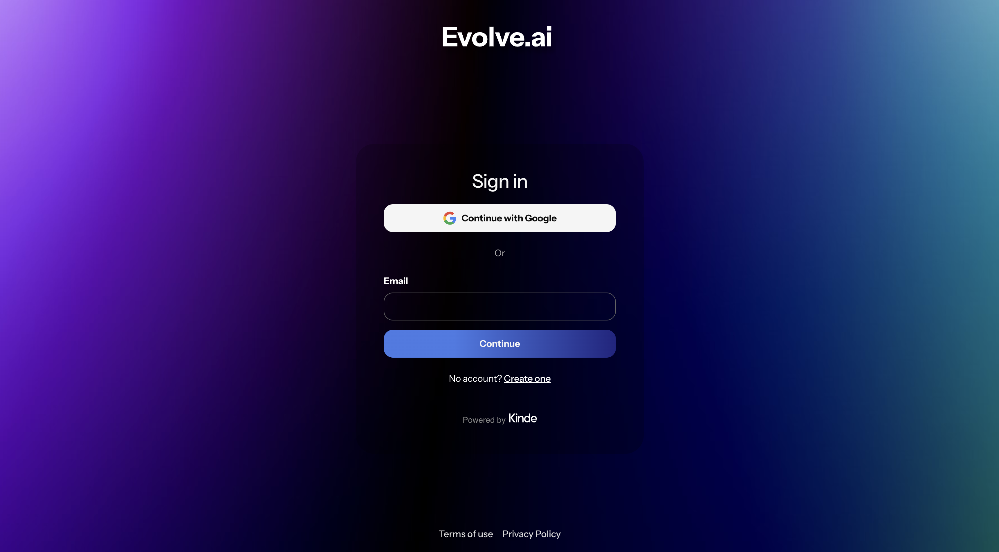

# 🤖 Evolve.ai - Kinde Custom UI Starter Template

A fully customizable UI starter template built with React Server Components and Kinde's Custom UI feature. Design your auth flows with complete control over the UI.

## Preview

View [live demo](https://evolveai.kindedemo.com/auth/cx/_:nav&m:login&psid:0194f24f2a4c79a57138aa68cec78ab4)



## Features

- 🎯 Full control over auth UI design and layout
- 🚀 Built with React Server Components
- 🔒 Kinde Authentication integration
- 📱 Responsive design out of the box

## Prerequisites

- npm or yarn
- A Kinde account with Custom UI feature enabled

## Quick Start

This template is designed to work with Kinde's Git Sync feature, allowing you to manage your Custom UI directly from GitHub.

### 1. Setup
Fork this repository to your own GitHub account, then clone it locally to begin editing:

```
# Clone your forked repository
git clone https://github.com/YOUR_USERNAME/custom-ui-evolve-ai.git
 
 # Enter the directory
 cd custom-ui-evolve-ai
 
 # Install dependencies
 npm install
 ```
 
 ### 2. Connect to Kinde
 To deploy your UI, link your repository to Kinde:
 
 1. Log in to Kinde Admin and go to Settings > Design > Custom UI.
 2. Select Connect to GitHub.
 3. Authorize access and select your forked custom-ui-evolve-ai repository.
 
 ### 3. Workflow
 Kinde automatically watches your repository for updates.
 
 * Push changes to your main branch to trigger a sync.
 * Return to the Custom UI page in Kinde to preview your new version and publish it live.


## Customization Guide

### Page Layouts

The template includes customizable layouts for all authentication pages:

- Sign In
- Sign Up
- Password Reset
- Email Verification
- Multi-factor Authentication
- Social Authentication
- Error Pages
- And more...

Each layout can be customized in the `kindeSrc/enviroment/pages/(kinde)` directory.

## Project Structure

```
📂 splitScape
├── 📂 kindeSrc
│   └── 📂 environment
│       └── 📂 pages
│           ├── ⚛️ layout.tsx
│           ├── 📄 styles.ts
│           └── 📂 (kinde)
│               └── 📂 (default)
│                   └── ⚛️ page.tsx
└── 📄 kinde.json

```

## Contributing

We welcome contributions! Please feel free to submit a Pull Request.

1. Fork the project
2. Create your feature branch (`git checkout -b feature/AmazingFeature`)
3. Commit your changes (`git commit -m 'Add some AmazingFeature'`)
4. Push to the branch (`git push origin feature/AmazingFeature`)
5. Open a Pull Request

## License

This project is licensed under the MIT License - see the [LICENSE](LICENSE) file for details.

## Support

Need help? Here are some resources:

- Check out the [video demos](https://www.loom.com/share/folder/4398af02bbde4f498952ab4654a331a3) for implementation examples
- Join the [Kinde Community](https://community.kinde.com)
- Open an issue on GitHub
- Review the [Kinde documentation](https://docs.kinde.com)
